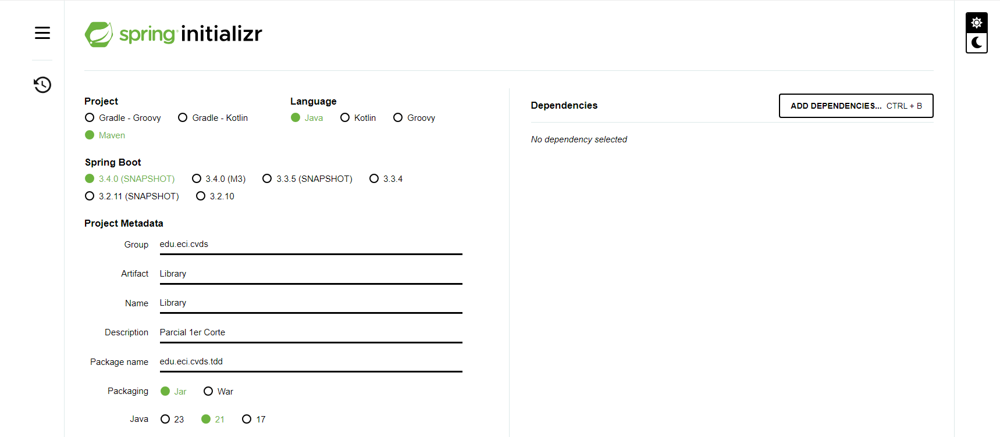
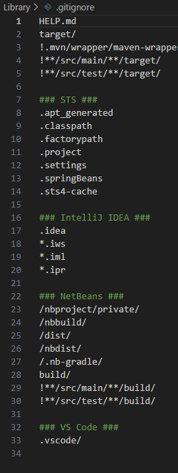
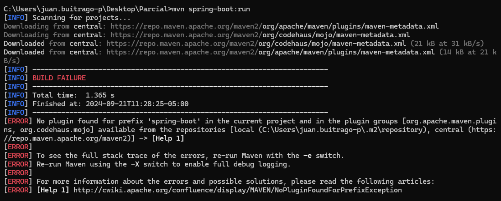
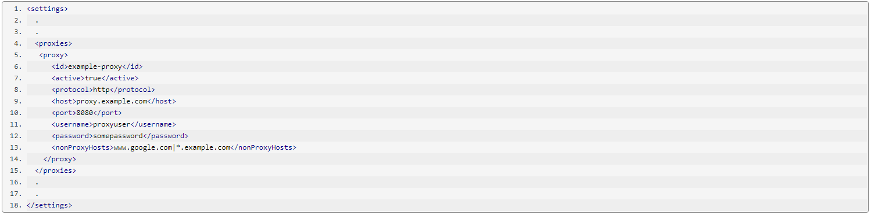
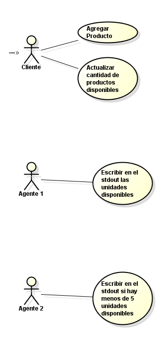
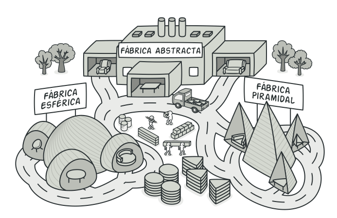
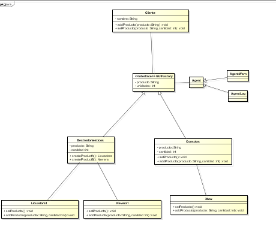
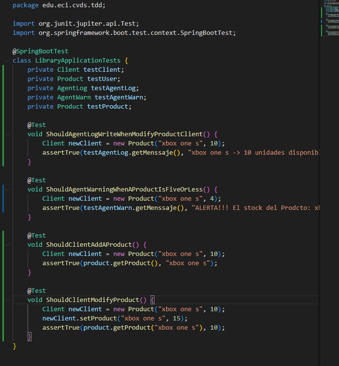
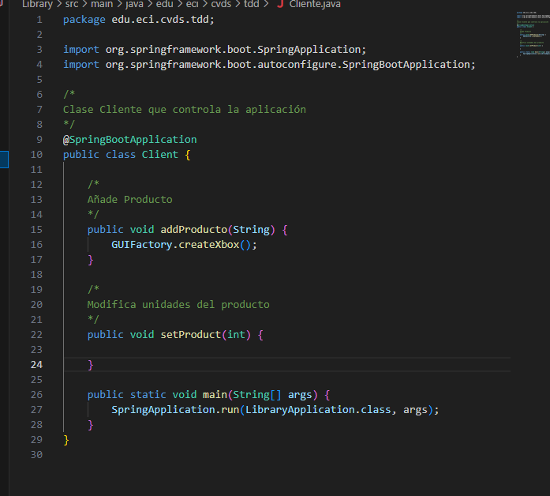
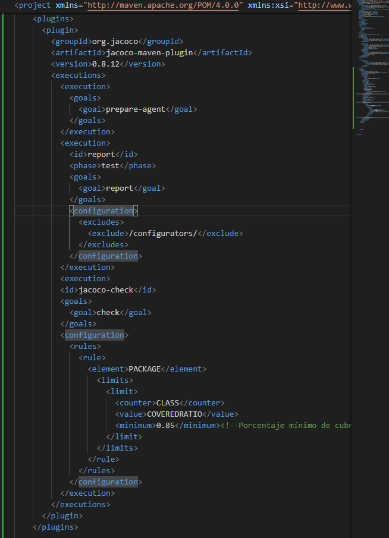

# Juan Sebastian Buitrago Piñeros
# PARCIAL PRIMER CORTE - SOLID, PATRONES, TDD, SPRING

## PRE-RREQUISITOS
- Java JDK Runtime Environment: 17.x.x
- Apache Maven: 3.9.x
- JUnit: 5.x.x

## NECESIDAD DEL CLIENTE
El cliente necesita un sistema de monitoreo de stock de productos, el cual le permita agregar productos nuevos y actualizar la cantidad de productos disponibles. Adicionalmente cada vez que un producto sea actualizado es necesario que se notifique a los dos agentes que serán implementados; Para los agentes es necesario tener en cuenta las siguientes características, el primero deberá escribir en el stdout las unidades disponibles y el segundo agente deberá escribir en el stdout si hay menos de 5 unidades disponibles lo cual generará una alerta. Estas funcionalidades deben ser expuestas en un servicio REST.
## REQUERIMIENTO
### FUNCIONALES
1. **Añadir un producto:** los productos deben tener nombre, precio, cantidad en stock y categoría.
2. **Modificar stock:** Se debe actualizar la cantidad de producto disponible y adicionalmente se debe notificar a los interesados.
    - Notificar el cambio de stock: Los agentes se deben ejecutar según los requerimientos de cada uno, cuando el stock de cualquier producto se vea afectado.
### AGENTES:
##### AGENTE LOG
Este agente debe escribir en stdout cada vez que se modifica el stock de un producto.
Ejemplo:
```bash
 Prodcto: xbox one s -> 10 unidades disponibles
 ```
##### AGENTE ADVERTENCIA
Este agente debe escribir en stdout cada vez que el stock de un producto es menor a 5.
Ejemplo:
```bash
 ALERTA!!! El stock del Prodcto: xbox one s es muy bajo, solo quedan 4 unidades.
 ```
## DESCRIPCIÓN DEL PROYECTO
Se debe crear un repositorio en GitHub el cual debe tener un proyecto maven que funcione con spring-boot, este proyecto deberá darle solución a los requerimientos del cliente y seguir los principios SOLID. Se debe implementar por lo menos un patrón de diseño, usar la inyección de dependencias para instaciar objetos y es necesario que los endpoint REST utilicen los métodos (GET, POST, PATCH, PUT, DELETE), dependiendo de la operación que sea requerida. El proyecto debe tener pruebas unitarias y jacoco como plugin de cobertura y esta  cobertura deberá ser  superior al 80%.

#####  ES IMPORTANTE RECORDAR QUE:

1. El almacenamiento puede ser en estructuras en memoria como Listas, Mapas, etc
2. El proyecto debe funcionar localmente en el puerto 8080.
3. Se debe subir el link del proyecto en el espacio de campus virtual

Se creo el proyecto por medio de (https://start.spring.io/)



Se hizo el .gitignore



En teoria el proyecto funciona con spring-boot, pero da un error que hasta el momento no se sabe muy bien cúal es, por lo que se correran las pruebas para respaldar que el codigo funciona correctamente.



Se intentó colocar el puerto 8080, pero continua sin funcionar



Se hizo un diagrama de casos



# Patron de Diseño

Se implementará el patron de diseño Abstract Factory, porque dado que en teoria existen varios productos de diferentes clasificaciones.
Estas clasificaciones podrían ser distintas, consolas, electrodomesticos, entre otros, y esos electrodomesticos pueden ser diferentes cosas de diferentes marca y fabricantes.



Por lo que se hará el diagrama de clases correspondiente. Ademas de la inyeccion de dependencias por medio de la clase abstracta FabricaProducto



Se hace la creacion de pruebas para cumplir con el TDD.



# Creacion de Clases 




# Jacoco
Se agrega la dependencia de Jacoco



Y por último se prueba el código para ver cuanto de él esta realmente probado.